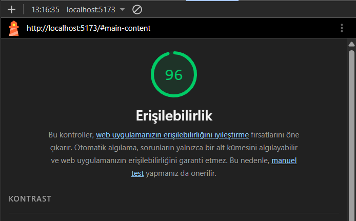

# Web Tasarımı ve Programlama - Kişisel Portföy Projesi

Bu proje, Web Tasarımı ve Programlama dersi laboratuvarları (LAB-1'den LAB-4'e kadar) kapsamında Vite + React + TypeScript ve Tailwind CSS kullanılarak oluşturulmuştur.

## Geliştirici
- **Ad Soyad:** Sabri Baz
- **Öğrenci No:** 240541164
- **Bölüm:** Yazılım Mühendisliği

## Kullanılan Teknolojiler
- React 18
- TypeScript
- Vite
- Tailwind CSS v4

## Kurulum
Projenin bağımlılıklarını yüklemek ve yerel sunucuda çalıştırmak için terminalde aşağıdaki komutları sırayla çalıştırın:

```bash
npm install
npm run dev
```

## Lighthouse Erişilebilirlik Raporu
Bu projenin erişilebilirlik denetimi Google Lighthouse ile yapılmıştır.



**Skor: 96/100**

---

## LAB-3 & LAB-4: CSS Tasarım Kararları ve Responsive Mimari Raporu

Bu doküman, kişisel portföy projesinin CSS mimarisi kurulurken alınan tasarım kararlarını, kullanılan teknolojileri ve "Neden?" sorularının cevaplarını içermektedir. Projede tamamen **Mobile-First (Önce Mobil)** yaklaşımı benimsenmiştir.

### 1. Mimari Yaklaşım: Mobile-First
Projeye başlarken varsayılan CSS kodları (0-639px arası ekranlar için) mobil cihazlar hedeflenerek yazılmıştır. Bu sayede CSS dosyası yukarıdan aşağıya okunurken önce en temel ve sade yapı yüklenir. Daha büyük ekranlar için ise `@media (min-width: 640px)` (Tablet) ve `@media (min-width: 1024px)` (Masaüstü) kırılma noktaları (breakpoints) kullanılarak tasarım kademeli olarak genişletilmiştir. Bu yaklaşım, performans ve kod sürdürülebilirliği açısından tercih edilmiştir.

### 2. Design Tokens (Tasarım Değişkenleri)
Projedeki renk paleti, boşluklar (spacing), tipografi ve gölge gibi tekrarlayan değerler `token.css` dosyası içinde CSS Global Değişkenleri (`:root`) olarak tanımlanmıştır.
* **Neden kullanıldı?** Projenin ilerleyen aşamalarında bir rengi veya boşluk değerini değiştirmek istediğimizde, yüzlerce satır kodu gezmek yerine tek bir merkezden (token dosyasından) güncelleme yapabilmek için bu sistem kuruldu. Ayrıca `clamp()` fonksiyonu ile "Fluid Typography" (Akışkan Tipografi) kullanılarak fontların ekran boyutuna göre esnek bir şekilde büyümesi/küçülmesi sağlandı.

### 3. Flexbox ile Tek Boyutlu Düzenler
Sayfa içindeki hizalama ve dağıtma işlemleri için yoğun olarak Flexbox kullanılmıştır:
* **Header ve Navigasyon:** Masaüstü görünümünde logo ve menüyü iki zıt köşeye itmek için `justify-content: space-between` kullanıldı. Mobil görünümde ise `flex-direction: column` ile menü elemanları dikey bir yığın haline getirildi.
* **Hakkımda Bölümü:** Mobilde resim ve metin alt alta (`column`) dizilirken, 640px ve üzeri ekranlarda `flex-direction: row` ile yan yana şık bir görünüme kavuşturuldu.
* **Skill Tags (Yetenekler):** Proje kartlarındaki etiketlerin (React, Node.js vb.) yan yana esnek dizilmesi ve sığmadığında alt satıra geçmesi için `flex-wrap: wrap` özelliği uygulandı.

### 4. CSS Grid ile İki Boyutlu Düzen
"Projelerim" bölümündeki kartların listelenmesi için CSS Grid mimarisi tercih edilmiştir. Flexbox yerine Grid kullanılmasının temel sebebi, elemanları hem satır hem de sütun bazında daha simetrik kontrol edebilmektir.
* **Sihirli Satır:** `grid-template-columns: repeat(auto-fit, minmax(280px, 1fr))` kodu sayesinde, hiçbir Media Query yazmaya gerek kalmadan kartların genişliği 280px'in altına düşmeyecek şekilde ayarlandı. Ekran genişledikçe kartlar otomatik olarak boşlukları dolduracak şekilde yan yana dizildi.

### 5. UI/UX ve Mikro Etkileşimler
Kullanıcı deneyimini artırmak için çeşitli dokunuşlar yapılmıştır:
* Tıklanabilir elemanlara (linkler ve butonlar) `transition` eklenerek renk geçişlerinin yumuşak olması sağlandı.
* Proje kartlarına `:hover` durumu eklendi. Kullanıcı kartın üzerine geldiğinde kart `transform: translateY(-4px)` ile hafifçe yukarı kalkmakta ve `box-shadow` ile belirginleşmektedir.
* Resimlerin kapsayıcılarından taşmasını engellemek ve form oranını korumak için `object-fit: cover` ve `aspect-ratio` özellikleri kullanıldı.